# rowkit — бриф на современную тему в стиле macOS

7 октября 2026 · бриф для дизайнера. Код темы — в ветке `feat/themes`: [`packages/tokens/src/themes/modern.ts`](../../packages/tokens/src/themes/modern.ts), глифы иконок — [`packages/ui/src/icons/modern/`](../../packages/ui/src/icons/modern/), как сделать свою тему — [`docs/foundations/themes.md`](../../docs/foundations/themes.md).

## Задача и решения

У rowkit появляется вторая тема — современная, в стиле macOS. Она переключается на лету вместе с Windows 98. Компоненты и их API не меняются: меняются только токены. Цель — чтобы один и тот же экран в двух темах выглядел как два разных продукта, и каждый из них был сделан настоящим дизайнером.

Решения, которые уже приняты:

- **Имя в коде:** `modern` (`data-theme="modern"`). Слово macOS в продукте не используем: это товарный знак Apple. Ориентир по стилю — macOS последних версий и iOS: системные контролы, настройки, Finder.
- **Светлая и тёмная схемы.** По умолчанию следуют за системой, можно зафиксировать вручную. У Windows 98 схема одна, светлая, и это не меняется.
- **Современная тема становится темой по умолчанию, как только дизайн готов.** Её скриншот идёт первым в README, на обложке портфолио и на главной rowkit.dev. Windows 98 остаётся второй, яркой темой (`data-theme="win98"`): она уже нарисована и в этой работе не меняется ни на пиксель.
- **Меняется всё:** цвет, шрифт, размеры контролов, радиусы, тени, фокус, состояния hover / pressed / disabled, скроллбары, анимации, иконки, заголовок окна. В современной теме не должно остаться ни одной детали Windows 98.
- **Сайт rowkit.dev и Storybook переключаются вместе с компонентами.** В современной теме сайт — это рабочий стол в духе macOS (строка меню, окна, Dock), а не рабочий стол Windows 98 в других цветах.
- **Шрифт:** в Figma — SF Pro. В коде — системный стек (`-apple-system`, `BlinkMacSystemFont`) с Inter как запасным вариантом на Windows и Linux. Распространять SF Pro с библиотекой лицензия не разрешает.
- **Иконки:** SF Symbols вне платформ Apple использовать нельзя. Нужен свой контурный набор в их духе (см. «Визуальный язык»).

Механизм тем уже сделан в ветке `feat/themes`: Windows 98 не изменилась ни на пиксель, а черновик модерн-темы по гайдлайнам Apple уже работает в Storybook и на сайте. Задача дизайнера — довести его до чистового вида в Figma; после этого черновик в коде заменяется его значениями, компоненты при этом не трогаются.

## Визуальный язык

Ориентир — системный интерфейс macOS последних версий (Настройки, Finder) и iOS: светлые сдержанные поверхности, один синий акцент, скругления, мягкие тени, кольцо фокуса вокруг контрола. Тема должна оставаться плотной: rowkit — библиотека для таблиц и форм, а не для лендингов. Значения ниже — черновик из кода, он уже работает. Меняйте их свободно, если так выйдет лучше, кроме требований по контрасту.

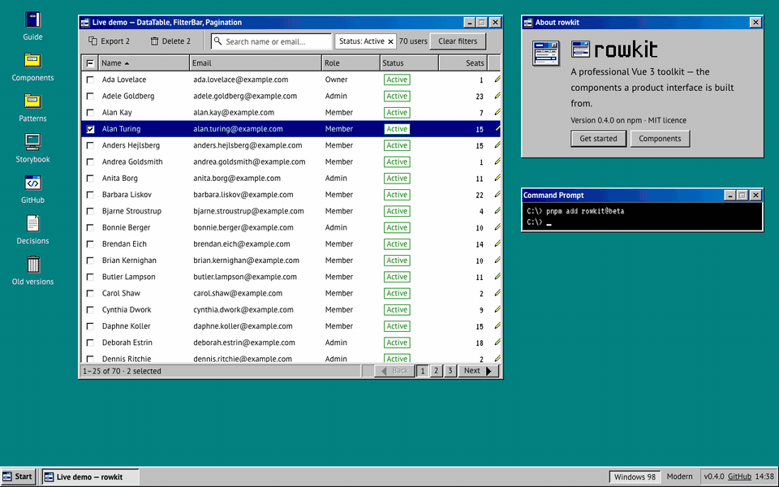

### Цвет

Семантические цвета задаются для трёх наборов: Windows 98 (уже есть), Modern Light и Modern Dark. Черновые значения:

| Роль                     | Токен                                 | Light                | Dark                 |
| ------------------------ | ------------------------------------- | -------------------- | -------------------- |
| Фон окна / страницы      | `background`                          | `#F5F5F7`            | `#1C1C1E`            |
| Панель, карточка, окно   | `card`                                | `#FFFFFF`            | `#2C2C2E`            |
| Поле ввода, тело таблицы | `input`                               | `#FFFFFF`            | `#1C1C1E`            |
| Выпадающий список, меню  | `popover`                             | `#FFFFFF` 85% + blur | `#323234` 88% + blur |
| Основной текст           | `foreground`                          | `#1D1D1F`            | `#F5F5F7`            |
| Вторичный текст          | `muted-foreground`                    | `#515154`            | `#E0E0E5`            |
| Подсказки, placeholder   | `text-subtle`                         | `#6E6E73`            | `#AEAEB2`            |
| Недоступное              | `text-disabled`                       | `#AEAEB2`            | `#86868B`            |
| Разделители              | `border`                              | `#D2D2D7`            | `#48484A`            |
| Край поля                | `border-strong`                       | `#86868B`            | `#86868B`            |
| Акцент, выделение        | `surface-selected`, `control-primary` | `#0071E3`            | `#0071E3`            |
| Ссылка                   | `link`                                | `#0066CC`            | `#2997FF`            |
| Кольцо фокуса            | `focus-ring`                          | `#0071E3` 80%        | `#2997FF` 80%        |

Статусы (`neutral`, `primary`, `success`, `warning`, `danger`) — по шесть оттенков на каждый: solid, solid-hover, on-solid, subtle, on-subtle, border. Черновик: синий `#0071E3`, зелёный `#1F7A35`, оранжевый `#FF9F0A` с тёмным текстом, красный `#D70015`. Светофор окна — `#FF5F57`, `#FEBC2E`, `#28C840`.

Контраст — жёсткое требование, его проверяют тесты. Текст — не ниже 4.5:1. Край поля, отметка чекбокса, заполнение прогресс-бара и кольцо фокуса — не ниже 3:1 к своему фону. Поэтому край поля в черновике темнее, чем в macOS. Если найдёте решение светлее, которое проходит 3:1, — отлично.

### Типографика

- **Шрифт:** в Figma — SF Pro Text и SF Mono. В коде — системный стек с Inter для Windows и Linux.
- **Интерфейс:** 13/18 regular. Заголовок окна и акцент — 13/18 semibold (600 вместо bold 700 у Windows 98).
- **Заголовок группы:** 15/20 semibold.
- **Моноширинный:** 12/18 (вместо VT323 16/16).
- **Сайт документации:** текст 16/26, h1 26/30, h2 19/24, h3 15/20 — как сейчас, но гарнитура SF Pro.

### Размеры

| Что                                      | Windows 98, px    | Modern (черновик), px |
| ---------------------------------------- | ----------------- | --------------------- |
| Контрол xs / sm / md / lg                | 21 / 26 / 28 / 33 | 24 / 28 / 32 / 40     |
| Квадратная icon-кнопка xs / sm / md / lg | 25 / 27 / 30 / 34 | 24 / 28 / 32 / 40     |
| Строка таблицы sm / md                   | 22 / 27           | 30 / 36               |
| Чекбокс, радио                           | 13, 12            | 16, 16                |
| Пункт списка или меню                    | 22                | 28                    |
| Заголовок окна                           | 22                | 38                    |
| Кнопка заголовка                         | 20×18             | 12×12, шаг 8          |
| Прогресс-бар                             | 18                | 6                     |
| Скроллбар                                | 16, со стрелками  | 10, без стрелок       |

На тач-экранах цель не меньше 24px, как и в Windows 98.

### Радиусы

`xs` 4 (чекбокс), `sm` 5 (пункт меню, подсказка), `md` 7 (кнопка, поле), `lg` 10 (список, таблица, карточка), `xl` 12 (окно, диалог), `pill` — капсула (бейдж, чип, прогресс, светофор). В Windows 98 все радиусы 0.

### Тени и материалы

- **Кнопка:** обводка 1px чёрным 12% плюс тень 0 1 2 чёрным 10%. В тёмной схеме — обводка чёрным 50% и блик 1px сверху белым 12%.
- **Поле:** внутренняя обводка 1px цветом `border-strong`.
- **Окно, диалог, тост:** обводка 1px плюс две мягкие тени (0 2 6 и 0 16 40).
- **Выпадающий список, меню, Dock:** «стекло» — полупрозрачный `popover` с размытием 24px и насыщенностью 180%, обводка 1px, тень 0 10 30.
- **Таблица, GroupBox:** обводка 1px цветом `border`, без тени.

### Фокус и состояния

- **Фокус:** кольцо 3px цвета `focus-ring` снаружи контрола, по его радиусу. В строке таблицы и в прокручиваемой области — кольцо 2px внутри. Пунктира Windows 98 нет.
- **Hover:** у кнопок — едва заметное изменение заливки; у ghost-кнопок и пунктов меню — подложка чёрным 6%.
- **Pressed:** заливка темнее, подпись не сдвигается.
- **Toggle (зафиксирован нажатым):** серая подложка `control-latched` вместо дизеринга.
- **Disabled:** цвет `text-disabled`, без тиснения и без прозрачности всего контрола.
- **Отмеченный чекбокс или радио:** синяя заливка, белая галочка или точка.

### Движение

- Смена состояния контрола — 120ms.
- Появление окна, диалога, списка, тоста — 160ms: прозрачность от 0 и масштаб от 0.97.
- Скелетон — пульс прозрачности 1.6s вместо шагающего дизера.
- При включённом «уменьшении движения» анимаций нет.

### Иконки

Сейчас в модерн-теме поверх пиксельных иконок рисуются контурные глифы Lucide — это заглушка. Нужен свой набор в духе SF Symbols (сами SF Symbols вне платформ Apple использовать нельзя):

- контур, сетка 24, штрих около 1.5px на 16px, скруглённые концы;
- одноцветные: цвет задаёт код;
- статусные иконки (info, success, warning, error) и папки красятся в цвет статуса;
- 42 иконки по списку в разделе «Что сдать», включая глифы светофора (×, −, +, восстановить).

## Контракт темы

Тема — это набор значений для фиксированного списка токенов. Компоненты уже размечены этими токенами, поэтому всё, что нарисовано в Figma через Variables с теми же именами, переносится в код без правок компонентов. Имена ниже точные, из кода.

| Коллекция в Figma       | Режимы                                  | Что в ней                                                     |
| ----------------------- | --------------------------------------- | ------------------------------------------------------------- |
| `semantic` (уже есть)   | Windows 98 · Modern Light · Modern Dark | 96 цветовых токенов                                           |
| `primitives` (уже есть) | —                                       | палитра VGA; добавить группу `modern/*`                       |
| `size` (новая)          | Windows 98 · Modern                     | 50 размеров компонентов                                       |
| `radius` (уже есть)     | Windows 98 · Modern                     | none, xs, sm, md, lg, xl, full, pill                          |
| `type` (новая)          | Windows 98 · Modern                     | гарнитура, размеры ui / heading / mono / doc-mono, вес strong |

Тени в Figma не переключаются режимами, поэтому они становятся Effect styles с префиксом темы: `win98/raised`, `modern-light/raised`, `modern-dark/raised` и так далее. Каждая тень — роль, а не фаска. В Windows 98 она рисуется фаской, в модерн-теме её можно оставить пустой.

```text
ЦВЕТ (semantic)
background desktop card muted accent surface-active surface-selected surface-disabled
skeleton input tooltip-bg tooltip-border foreground muted-foreground text-subtle
text-disabled text-disabled-emboss on-selected link border border-strong border-subtle
ring focus-ring shadow bevel-highlight bevel-light bevel-shadow bevel-dark
titlebar-from titlebar-to titlebar-inactive-from titlebar-inactive-to
titlebar-foreground titlebar-inactive-foreground
{neutral|primary|success|warning|danger}-{solid, solid-hover, on-solid, subtle, on-subtle, border}
control control-foreground control-hover control-active
control-primary control-primary-foreground control-primary-hover control-primary-active
control-ghost-hover control-ghost-active control-latched field-button
checked on-checked popover popover-border
caption caption-foreground caption-close caption-minimize caption-maximize caption-inactive
table-header table-header-foreground table-stripe
track progress scroll-thumb scroll-track groupbox groupbox-face

ТЕНИ (effect styles, на каждую тему)
raised raised-default pressed raised-thin sunken status etched window popover
table header caption statusbar titlebar checked field-button scroll-thumb
scroll-x sticky-header

РАЗМЕРЫ (size)
control-{xs,sm,md,lg} icon-{xs,sm,md,lg} button-min-{xs,sm,md,lg} button-px-{xs,sm,md,lg}
field-px field-px-lg check radio item popover-inset row-sm row-md chip-sm chip-md
titlebar titlebar-px caption-w caption-h caption-gap caption-close-gap
title-inset-start title-inset-end frame tooltip-px tooltip-py statusbar
progress progress-inset progress-fill progress-block progress-period
scrollbar scroll-button scroll-inset
groupbox-top groupbox-pt groupbox-legend-x groupbox-legend-px
```

Кроме значений, у темы есть «переключатели стиля»: решения о том, как рисуется состояние. Для модерн-темы они выбраны так. Подтвердите или предложите иное:

| Решение                      | Windows 98                  | Modern (черновик)                              |
| ---------------------------- | --------------------------- | ---------------------------------------------- |
| Где рисуется фокус           | пунктир вокруг подписи      | кольцо 3px вокруг контрола                     |
| Нажатие                      | подпись сдвигается на 1px   | заливка темнее, без сдвига                     |
| Нажатый toggle, трек скролла | дизеринг                    | сплошная заливка                               |
| Disabled                     | серый с тиснением           | серый                                          |
| Кнопки окна                  | справа, «закрыть» последней | слева, «закрыть» первой; глифы — при наведении |
| Заголовок окна               | слева, на градиенте         | по центру, на фоне окна                        |
| Фон под модальным окном      | нет                         | чёрный 15%                                     |
| Радио                        | пиксельный рисунок          | круг с точкой                                  |
| Стрелки скроллбара           | есть                        | нет                                            |
| Иконки                       | пиксельные, многоцветные    | контурные, одноцветные                         |

Если для дизайна нужно различие, которого нет в списке (например, отдельный hover для строки таблицы), не обходите его локальным цветом. Заведите новую Variable и добавьте её на страницу «Новые токены»: в коде появится такой же токен со значением в каждой теме.

## Компоненты

Все 22 компонента первой волны нужно нарисовать в модерн-теме, светлой и тёмной, с теми же вариантами и состояниями, что и в Windows 98. Структура страниц Figma не меняется: на странице компонента появляется свойство или режим Theme. На каждой картинке слева направо: Windows 98 как сейчас, черновик светлой и тёмной схем. Черновик — ориентир, а не образец.

### Button

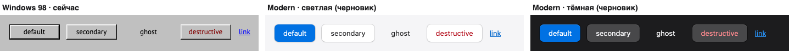

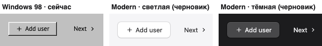

- **Варианты:** default (синяя, цель Enter), secondary (белая с обводкой), ghost (без фона, подложка при наведении), destructive (красная подпись), link.
- **Размеры:** xs, sm, default, lg и четыре квадратных icon-размера.
- **Состояния:** rest, hover, pressed, focus, disabled, loading (спиннер вместо песочных часов), toggle on/off.
- **Решить:** нужна ли минимальная ширина (в черновике 72px у default); как выглядит нажатый toggle в синей кнопке.

### ButtonGroup

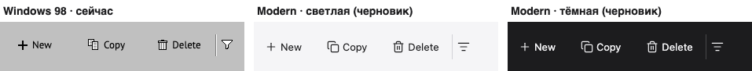

- В модерн-теме соседние кнопки склеиваются в сегментированный контрол: скругления только снаружи. Нарисовать горизонтальный, вертикальный и панель инструментов из icon-кнопок.
- Решить: нужен ли разделитель между сегментами.

### Input

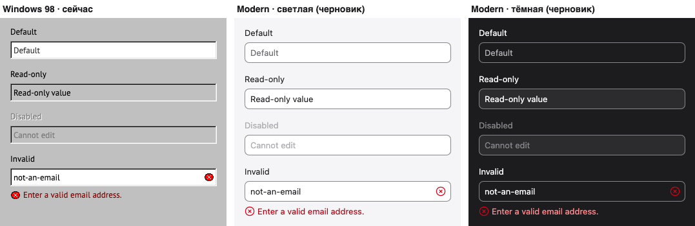

- **Состояния:** default, focus (кольцо вокруг всего поля), read-only, disabled, invalid (иконка ошибки в конце поля, текст ошибки — в Field).
- **Типы:** search (лупа слева), number (степпер ↑↓ справа), date (кнопка календаря), password.
- **Решить:** как выглядит invalid — красная рамка или, как сейчас, только иконка. В macOS чаще второе.

### Select

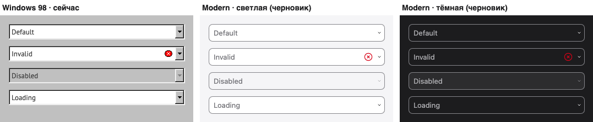

- **Триггер:** в черновике — поле со стрелкой. Решить: оставить так или сделать как pop-up button в macOS (синяя плашка с двойной стрелкой справа).
- **Список:** стекло, радиус 10, отступ 5, пункты 28px со скруглённой синей подсветкой, галочка у выбранного. Состояния: открыт, поиск, загрузка, пусто, disabled-пункт.

### Field

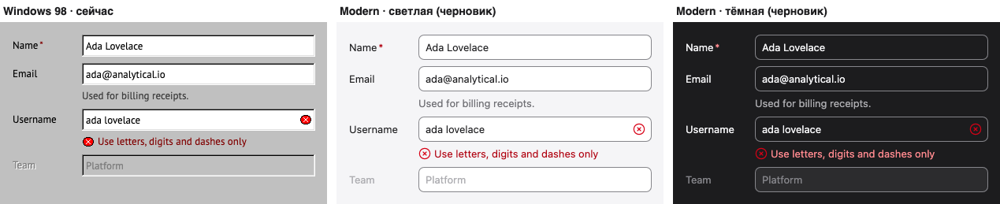

- Подпись сверху и слева, подсказка, ошибка с иконкой, обязательное поле, disabled. Подпись слева выравнивается по тексту поля для любой высоты.

### Checkbox и Radio

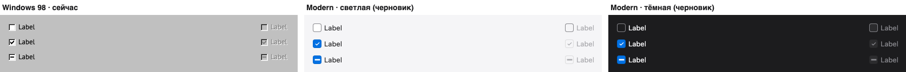

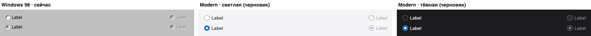

- **Состояния:** off, on, indeterminate (только чекбокс), каждое — rest, pressed, focus, disabled.
- **Размер:** 16px, радиус чекбокса 4. Решить, нужен ли Switch в духе iOS как отдельный компонент (в Windows 98 аналога нет).

### Badge

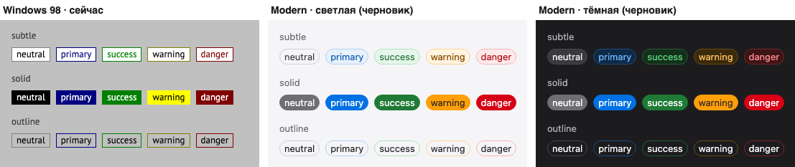

- 5 статусов × 3 вида (subtle, solid, outline) × 2 размера, с точкой и без. В черновике капсула. Решить: капсула или радиус 5.

### GroupBox и Separator

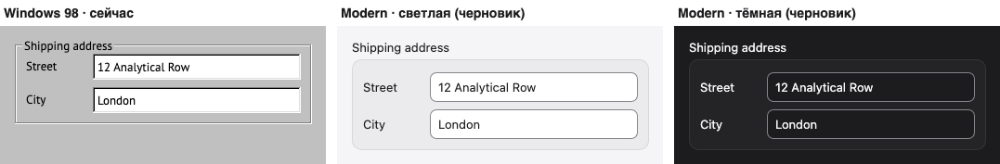

- В модерн-теме группа — скруглённая подложка с заголовком над ней, как секции в Настройках macOS; а не рамка с легендой на линии.
- Separator — одна тонкая линия вместо выдавленной пары.

### ProgressBar

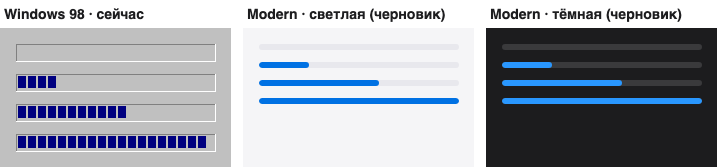

- Сплошная синяя полоса 6px в сером треке вместо блоков. Нарисовать 0, 25, 50, 100% и неопределённое состояние (его пока нет ни в одной теме — предложите).

### ScrollArea и скроллбар

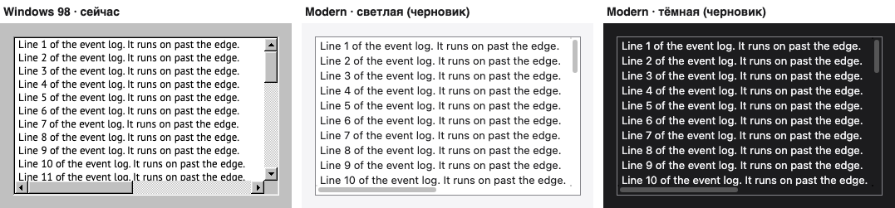

- Тонкий скруглённый ползунок на прозрачном треке, без стрелок. Решить: ползунок виден всегда или только при прокрутке (второе нужно согласовать: есть вопросы доступности).

### Window, StatusBar

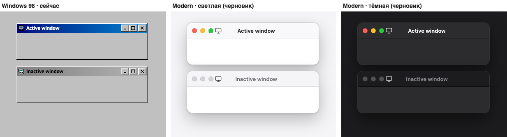

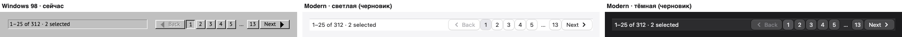

- **Окно:** радиус 12, заголовок 38px по центру, светофор слева. Глифы на светофоре появляются при наведении на заголовок, у неактивного окна кнопки серые.
- **Нарисовать:** активное, неактивное, светофор hover и pressed, кнопка «развернуть» disabled, окно со строкой состояния.
- **Решить:** иконка окна в заголовке — убираем (как в macOS) или ставим перед заголовком; строка состояния — с разделителями секций или без.

### Dialog

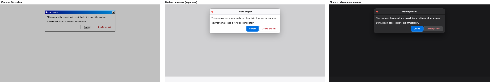

- Окно с одной красной кнопкой закрытия, затемнение фона 15%, появление 160ms. Размеры sm / md / lg, диалог с формой, длинный с прокруткой.
- Решить: оставляем заголовок в строке окна или делаем как alert macOS: без строки заголовка, иконка и заголовок сверху по центру. Второе потребует нового переключателя стиля — это нормально.

### Tooltip и Toast

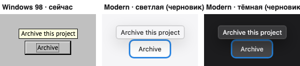

- **Tooltip:** светлая плашка с тонкой обводкой и тенью вместо жёлтой; в тёмной — тёмно-серая. Четыре стороны, длинный текст до 240px.
- **Toast:** скруглённая карточка с тенью окна, цветная статусная иконка, серая круглая кнопка ×, кнопка действия. В Storybook тосты появляются по кнопке, поэтому скриншота здесь нет. Нарисовать info, success, warning, danger и с действием.
- **Решить:** тост как уведомление macOS (стекло, справа сверху) или как сейчас (карточка снизу справа).

### DataTable, Pagination, FilterBar

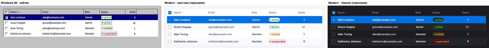

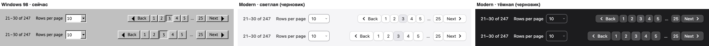

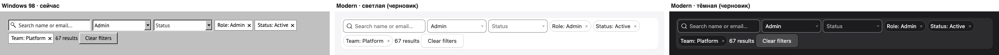

- **Таблица:** скруглённая рамка, заголовки серым текстом с линией снизу, чередующиеся строки, выделение синим.
- **Нарисовать таблицу в состояниях:** сортировка (стрелка), выбор строк чекбоксами и радио, закреплённые заголовок и колонка, строка итогов, числовая колонка (моноширинные цифры), загрузка, пусто.
- **Решить:** нужен ли hover строки; выделение строки — сплошное синее или скруглённое с отступами, как в Finder.
- **Pagination:** текущая страница — серая подложка. Решить: кнопки-цифры с обводкой или без.
- **FilterBar:** чипы-капсулы с ×, поле поиска, счётчик результатов, «Сбросить».

### EmptyState и Skeleton

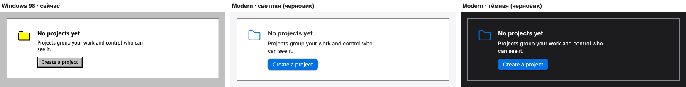

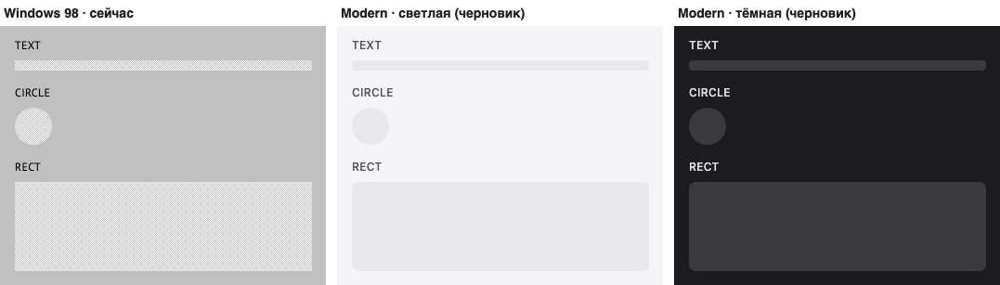

- **EmptyState:** три причины (нет данных, ничего не нашлось, ошибка) с крупной иконкой 32px. Решить: иконка слева, как сейчас, или по центру над текстом, как в macOS.
- **Skeleton:** серые скруглённые плашки с пульсацией: текст, круг, прямоугольник, несколько строк.

### Иконки

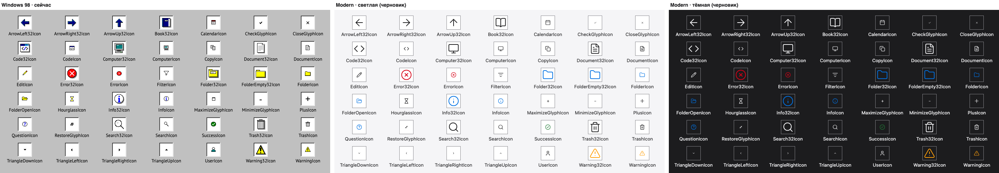

На каждую пиксельную иконку нужен контурный глиф с тем же именем. Имена перечислены в «Что сдать».

### Собранный экран

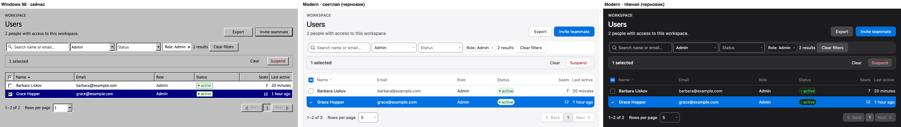

Этим экраном проверяется, что тема работает целиком. Нарисовать его в светлой и тёмной схемах вместе с двумя другими экранами первой волны.

## Сайт rowkit.dev

Сайт переключается вместе с библиотекой и в модерн-теме становится рабочим столом в духе macOS, а не перекрашенным Windows 98. Рабочий черновик уже есть в коде (ветка `feat/themes`, ссылка с `?theme=modern`). Задача — нарисовать чистовую версию всех шаблонов сайта в модерн-теме, светлой и тёмной.

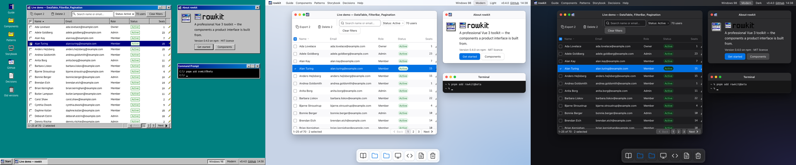

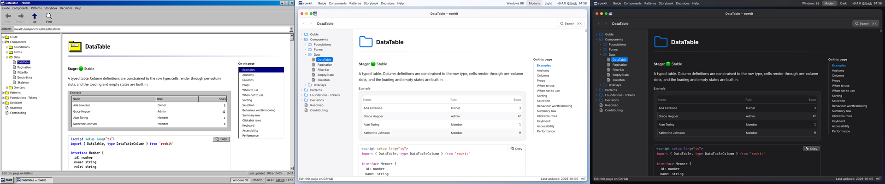

### Что во что превращается

| Часть сайта                    | Windows 98                                  | Modern                                                                                       |
| ------------------------------ | ------------------------------------------- | -------------------------------------------------------------------------------------------- |
| Фон                            | бирюзовый рабочий стол                      | обои-градиент (светлые и тёмные)                                                             |
| Панель задач внизу             | «Пуск», кнопка задачи, трей                 | строка меню сверху, 28px, стекло                                                             |
| Кнопка «Пуск» и меню           | меню с вертикальной полосой «rowkit 98»     | логотип + «rowkit» слева в строке меню, меню выпадает вниз                                   |
| Меню окна (Guide, Components…) | внутри окна проводника                      | в строке меню сверху, как меню приложения                                                    |
| Иконки на рабочем столе        | столбик слева с подписями                   | Dock внизу по центру, плитки 48px, подпись — во всплывающей подсказке                        |
| Окно проводника                | развёрнуто на весь экран                    | окно Finder с отступом 12px от краёв, скруглено                                              |
| Панель инструментов            | крупные Назад / Вперёд / Вверх / Найти 32px | ‹ ›, заголовок страницы, справа поиск «⌘K»                                                   |
| Адресная строка                | `rowkit:\Components\…`                      | нет; решить, нужна ли строка пути внизу окна                                                 |
| Дерево папок                   | белая вдавленная панель, [+]/[−], пунктир   | боковая панель серым фоном, треугольники раскрытия, скруглённая синяя подсветка              |
| «On this page»                 | вдавленный список с тёмно-синим выделением  | список с линией слева, текущий раздел синим полужирным                                       |
| Код                            | белое поле VT323, цвета IDE Windows 98      | скруглённый блок SF Mono, цвета в духе Xcode (светлые и тёмные)                              |
| Таблицы в тексте               | как DataTable Windows 98                    | как DataTable модерн                                                                         |
| Блоки tip / warning / danger   | панель с иконкой 32px                       | карточка с цветной иконкой; сейчас ещё с пиксельными иконками — нарисовать                   |
| «Командная строка»             | `C:\> pnpm add rowkit@beta`                 | «Terminal», `~ % pnpm add rowkit@beta`, тёмный в обеих схемах                                |
| Поиск (Find)                   | окно «Найти» Windows 98                     | в черновике — диалог; нарисовать как Spotlight: поле по центру сверху с результатами под ним |
| 404                            | диалог «Не удается найти…»                  | alert macOS в центре рабочего стола                                                          |
| Страница Tokens                | палитра и фаски Windows 98                  | палитра и тени текущей темы                                                                  |

### Переключатель темы

- **Где:** в Windows 98 — в трее панели задач рядом с часами; в модерн-теме — справа в строке меню.
- **Сейчас в черновике:** две кнопки-переключателя «Windows 98 | Modern»; в модерн-теме ещё кнопка схемы Auto / Light / Dark.
- **Нарисовать:** финальный вид переключателя в обеих темах. Варианты: сегментированный контрол, иконка с меню или пункт «Вид → Тема» в меню. Переключатель должен сразу бросаться в глаза на главной: это главная демонстрация библиотеки.
- **Поведение:** выбор запоминается; ссылка с `?theme=modern&scheme=dark` открывает сайт сразу в нужном виде. Решить, нужен ли визуальный переход при переключении (например, короткий кросс-фейд).

### Экраны для отрисовки

Все — в светлой и тёмной схемах, 1280px; отмеченные — ещё и 390px.

1. Главная: рабочий стол, окна Live demo / About / Terminal, Dock, строка меню (+ 390px).
2. Главная с открытым меню rowkit (бывшее «Пуск»).
3. Страница компонента в окне Finder: боковая панель, заголовок, пример, код, таблица props, «On this page» (+ 390px).
4. Та же страница с открытым меню в строке меню (например, Components).
5. Поиск в стиле Spotlight: пустой, с результатами, «ничего не найдено».
6. 404.
7. Страница Tokens и новая страница Themes (на ней форма в двух темах рядом).
8. Переключатель темы крупно, во всех состояниях.
9. Картинки бренда для модерн-темы: превью ссылки (1200×630), баннер README, обложка портфолио. Логотип rowkit менять не нужно, но можно предложить версию значка для Dock.

Полноразмерные скриншоты черновика (светлая схема):

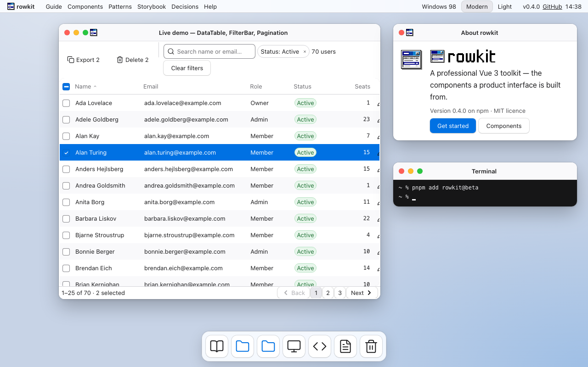

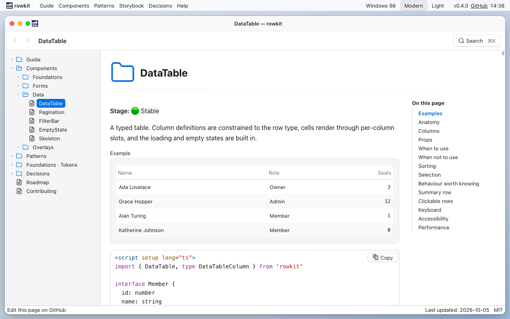

Известные слабые места черновика, на которые стоит обратить внимание:

- иконка rowkit в заголовке окна стоит вплотную к светофору;
- в блоках tip / warning и в заголовках страниц ещё пиксельные картинки;
- поиск — просто диалог, а не Spotlight;
- текст документации местами описывает только Windows 98 («чёрная рамка кнопки по умолчанию») — это правка текстов, не дизайна;
- мобильная версия сайта в модерн-теме пока только перекрашена, своего дизайна у неё нет.

## Что сдать

Всё — в том же файле [rowkit × Windows 98](https://www.figma.com/design/hmDfFpjrDP6WtEary6U6SE/rowkit-%C3%97-Windows-98): темы живут в режимах Variables, а не в отдельных файлах. Сдавайте по частям, в порядке списка: каждая готовая часть сразу переносится в код.

- [ ] **Variables.** Режимы Modern Light и Modern Dark в `semantic`; коллекции `size`, `type` и режим Modern в `radius`; группа `modern/*` в `primitives`. Имена — строго по разделу «Контракт темы».
- [ ] **Effect styles.** `modern-light/*` и `modern-dark/*` для всех 20 ролей теней; пустой стиль тоже стиль.
- [ ] **Решения по переключателям стиля** — таблица из «Контракта темы» с вашими ответами и решениями из пунктов «Решить» по компонентам.
- [ ] **Компоненты.** Все 22 со всеми вариантами и состояниями в двух схемах. Как минимум — переключение режима на странице компонента даёт правильную картинку.
- [ ] **Собранные экраны первой волны** в светлой и тёмной схемах.
- [ ] **Иконки.** 42 контурных глифа с теми же именами, что у пиксельных, каждый — отдельный компонент на сетке 24, одним цветом. Экспорт в SVG.
- [ ] **Сайт.** Девять экранов из раздела «Сайт rowkit.dev», в двух схемах.
- [ ] **Волна 2.** Компоненты из брифа волны 2 (Menu, Tabs, Combobox…) сразу рисуются в трёх режимах.

Имена иконок (суффикс `-32` — крупный вариант для системных сообщений и Dock, `-glyph` — маленький глиф внутри контрола):

```text
arrow-left-32  arrow-right-32  arrow-up-32  book-32  calendar  check-glyph  close-glyph
code  code-32  computer  computer-32  copy  document  document-32  edit  error  error-32
filter  folder  folder-32  folder-empty-32  folder-open  hourglass  info  info-32
maximize-glyph  minimize-glyph  restore-glyph  plus  question  search  search-32
success  trash  trash-32  triangle-down  triangle-left  triangle-right  triangle-up
user  warning  warning-32
```

### Как дизайн попадёт в код

1. Вы меняете значения в Variables и Effect styles.
2. Я переношу их в `packages/tokens/src/themes/modern.ts`, а SVG иконок — в `packages/ui/src/icons/modern/`. Компоненты не трогаются.
3. Тесты проверяют контраст и доступность обеих тем, Windows 98 сверяется попиксельно.
4. Решения, которые меняют структуру (диалог как alert, поиск как Spotlight), оформляются новыми переключателями стиля или правками сайта.
5. Когда дизайн готов, модерн-тема становится темой по умолчанию в библиотеке и на сайте, Windows 98 — второй темой.
